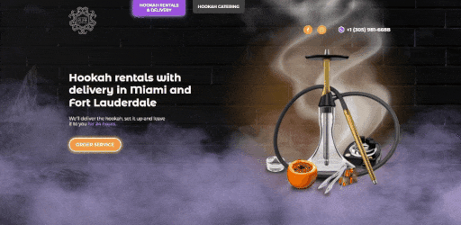

<h1><a href='https://hookah-miami.netlify.app'>🌟 Hookah Project 🌟</a></h1>

## О проекте 🚀

Проект "Кальян" - это увлекательный лендинг с двумя уникальными страницами, отличающийся адаптивным дизайном, модальными
окнами и настраиваемыми формами.

🎨 Кастомный дизайн, разработанный с учетом всех деталей.

📱 Адаптирован под разные устройства для максимального комфорта пользователей.

🔍 SEO-оптимизация для повышения видимости вашего проекта в поисковых системах.

🌟 Стиль в неоновом свете, создающий уникальную атмосферу.

🧩 Удобные формы в формате "quiz" для интерактивного взаимодействия с посетителями.

♿️ Accessibility - обеспечение доступности для всех пользователей, вне зависимости от их особенностей.

📱 Адаптирован для работы на различных устройствах.

🎉 Анимации, придающие проекту дополнительную динамику и привлекательность.

## Зависимости проекта 📦

Для этого проекта используются следующие зависимости:

* 🚀 [glide](https://www.npmjs.com/package/@glidejs/glide)
* 📤 [axios](https://www.npmjs.com/package/axios)
* 📌 [custom-select](https://www.npmjs.com/package/custom-select)
* ⚙️ [focus-trap](https://www.npmjs.com/package/focus-trap)

## Лицензия 📜

Этот проект распространяется под лицензией `MIT`. Дополнительную информацию можно найти в
файле [LICENSE](https://github.com/kluevevga/hookah/blob/master/LICENSE).

